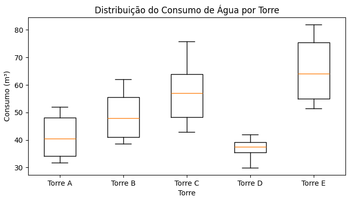
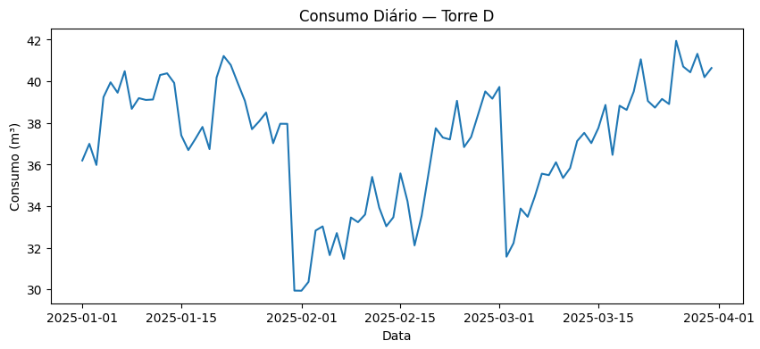

# 💧 Construction Water Consumption Anomaly Analysis

A data-driven case study demonstrating how phase-aware analysis can detect water leakage in construction projects.

---

## 📌 Overview

This project analyzes water consumption patterns across multiple construction sites to detect operational inefficiencies such as leaks, abnormal usage, and cost risks.

Using simulated but realistic data, the study models daily consumption by construction phase and applies statistical methods to identify anomalous behavior in one specific tower.

This project was developed as an initial exploration of water consumption monitoring in construction environments, inspired by a mentor’s product suggestion. The broader goal involves real-time analysis using live data, as outlined in the Potential Extensions section.

---

## 🎯 Business Problem

Construction projects consume large volumes of water, making inefficiencies difficult to detect without structured monitoring.

Key questions addressed:

- Which sites consume above expected levels?
- Are there abnormal consumption trends over time?
- Can leaks be detected early using data analysis?
- What is the potential operational impact?

---

## 🏗️ Dataset Description

Synthetic dataset representing five construction towers over a 90-day period.

### Features include:

- Tower identification
- Number of floors (structural scale)
- Construction phase (Accelerated, Intermediate, Reduction)
- Daily water consumption (m³)
- Temporal progression
- Simulated noise and leak dynamics (leakage in Tower D after day 35)

The dataset is divided into three phases to reflect realistic construction progress and to support early-stage analysis that could inform operational decision-making.

---

## ⚙️ Methodology

### 1. Exploratory Data Analysis (EDA)

- Temporal consumption analysis
- Comparison between towers
- Distribution analysis (boxplots, descriptive statistics)
- Identification of anomalous patterns

In order to detect the anomalous behavior a linear regression was applied over the whole Tower D consumption data. Interestingly, applying a single regression over the entire period was insufficient to detect the leakage. This led to a more specific approach, that is applying the method in each construction phase.

---

### 2. Phase-Aware Modeling

Consumption behavior varies by construction stage.

Phases modeled:

- Accelerated phase
- Intermediate phase
- Reduction phase

Segmenting analysis by phase allowed proper baseline comparison.

---

### 3. Statistical Trend Analysis

Linear regression applied within each phase to test for positive consumption trends over time.

Hypothesis tested:

- H₀: No growth trend (β₁ = 0)
- H₁: Positive growth trend (β₁ > 0)

---

### 4. Anomaly Quantification

Consumption in Tower D was benchmarked against peer towers normalized by structural scale (number of floors).

This enabled estimation of excess consumption attributable to abnormal behavior. This highlights the importance of contextual modeling when analyzing operational data.

---

## 📊 Key Findings

- No significant trend during the accelerated phase (normal operation)
- Statistically significant growth detected in later phases
- Behavior consistent with progressive leakage dynamics

### 🚨 Estimated Impact

- **Excess consumption:** ~393 m³  
- **Deviation from expected:** ~22.15%

This indicates measurable operational inefficiency with financial implications.

---

## ▶️ How to Run

1. Clone the repository
2. Open the notebook
3. Run all cells

---

## 🧠 Tools & Technologies

- Python
- Pandas
- NumPy
- Matplotlib
- Statsmodels
- Jupyter Notebook

---

## 📈 Potential Extensions

- Integration with real sensor data
- Automated anomaly detection models
- Cost estimation dashboards
- Cloud deployment (Azure / AWS)
- Real-time monitoring systems
- Detection of short-term anomalies

---

## 📌 Author

Victor Augusto Machado  
Control & Automation Engineer | Data & Analytics  

---

## 📜 License

This project is for educational and portfolio purposes.
