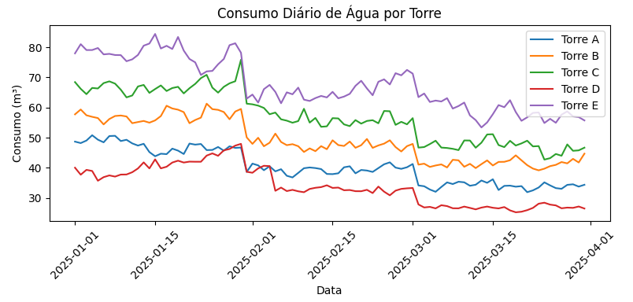
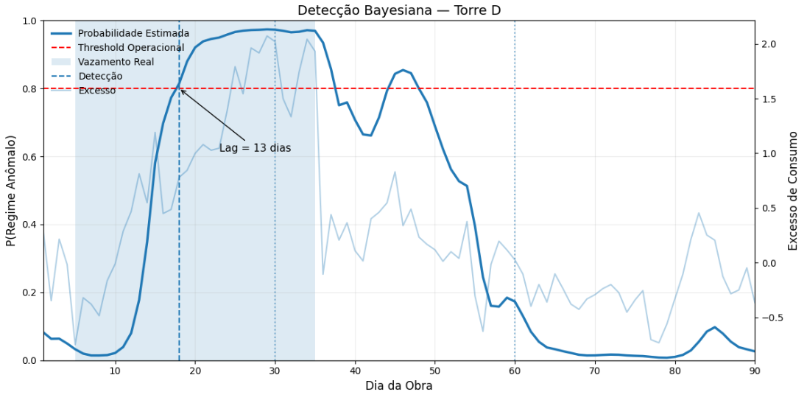
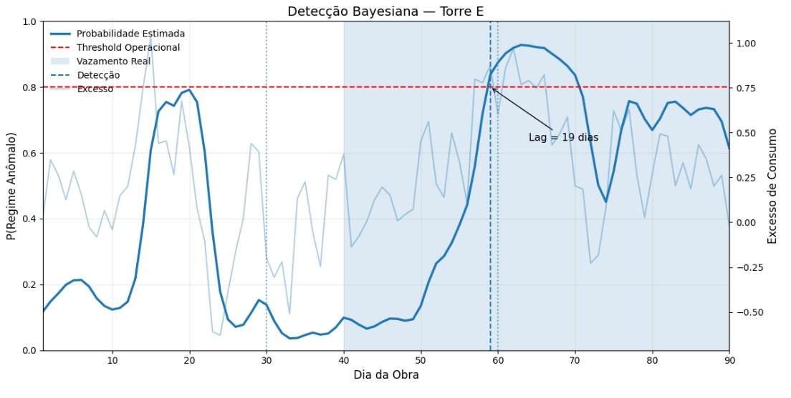

# 💧 Construction Water Anomaly Detection System  
### Dynamic Bayesian Anomaly Detection for Construction Water Consumption

---

## 📌 Overview

This project implements an online anomaly detection system designed to identify structural changes in water consumption patterns in construction environments.

Instead of relying solely on static statistical regression, the model introduces a dynamic detection architecture inspired by control theory principles:

- Bayesian online updating  
- Signal normalization by structural scale (m³ per floor)  
- Composite signal (level + discrete derivative)  
- Rolling window smoothing  
- Anti-windup behavior (τ-controlled adaptation rate)  
- Damping factor (γ)  
- Adjustable operational threshold  

The system detects gradual regime shifts, quantifies excess consumption, and translates statistical behavior into operational decision signals.

The project evolved from exploratory statistical analysis into a modular detection framework.

---

## 🔄 Project Evolution

This work evolved through two distinct technical stages.

### 🧪 v0 — Phase-Based Statistical Regression

The initial version focused on segmented linear regression applied within each construction phase.

**Key characteristics**

- Phase-aware data segmentation  
- Hypothesis testing (β₁ > 0)  
- Static trend analysis  
- Excess consumption benchmarking against peer towers  

**Limitations**

- Detection required full-phase data availability  
- Limited responsiveness to gradual regime changes  
- No real-time anomaly scoring mechanism  
- Purely static statistical framework  

This version validated abnormal behavior but lacked dynamic responsiveness.

---

### ⚙️ v1 — Bayesian Dynamic Regime-Change Detection

The current version introduces a control-inspired dynamic architecture:

- Online Bayesian anomaly score updating  
- Composite signal (level + discrete derivative)  
- Rolling window smoothing  
- Anti-windup adaptation (τ-controlled)  
- Damping factor (γ)  
- Adjustable operational threshold  

**Improvements over v0**

- Online detection capability  
- Reduced sensitivity to short-term noise  
- Stable convergence behavior  
- Regime-change modeling (abrupt and logistic shifts)  
- Quantification of post-detection excess  

This transition reflects a shift from static statistical analysis to dynamic system design.

---

## 🎯 Business Problem

Water leakage in construction projects is difficult to detect because:

- Consumption varies naturally by phase  
- Structural scale differs between towers  
- Leakage often evolves gradually rather than abruptly  

Operational teams require:

- Early detection of structural consumption shifts  
- Quantification of excess usage  
- Robust behavior without persistent false alarms  

---

## 🏗 Dataset Description

Synthetic but realistic dataset:

- 5 construction towers  
- 90 days  
- Phase-based progression:
  - Accelerated  
  - Intermediate  
  - Reduction  
- Daily water consumption (m³)  
- Controlled noise  

**Simulated leakage regimes**

- Tower D: earlier structural change  
- Tower E: smoother logistic regime change  

**Normalization applied**

\[
Consumption_{norm} = \frac{m^3}{floors}
\]

This ensures structural comparability across towers.

---

## 📊 Exploratory Analysis

### Cross-Tower Consumption Distribution

The boxplot highlights structural differences in normalized water consumption across towers.

#### 🏢 Tower D

- Positive skewness (right-skewed distribution)  
- Variance compression relative to peers  
- Upward shift in central tendency  
- Behavior inconsistent with expected structural scale  

The compressed interquartile range combined with elevated upper values suggests a sustained regime shift rather than isolated outliers.  
This pattern is structurally consistent with progressive leakage dynamics.

#### 🏢 Tower E

- Positive skewness (right-skewed distribution)  
- Presence of upper extreme events  
- Increased variability in later stages  

Unlike Tower D, Tower E exhibits delayed dispersion expansion, indicating a smoother transition toward abnormal consumption behavior.  
This aligns with a logistic-type regime change rather than an abrupt structural deviation.

Overall, the observed asymmetry signals non-stationary behavior that cannot be fully explained by construction phase progression alone.  
This motivates the need for a dynamic anomaly detection framework.

---

### 📈 Temporal Consumption Behavior Across Towers

The temporal evolution of daily water consumption reveals structural differences across towers throughout the construction phases.

During the **accelerated phase (first ~30 days)**, Tower D exhibits anomalous behavior relative to its structural scale. Although absolute values are lower than other towers, its trajectory shows instability and deviation from the proportional pattern observed in peer structures.

Tower E presents a subtler irregularity during the **intermediate phase**, where dispersion begins to widen. This divergence becomes more pronounced in the **reduction phase**, where its trajectory separates from the collective pattern.

In contrast, Towers A, B, and C maintain consistent proportional trends across phases, reflecting expected consumption dynamics.

These early signals of divergence motivate the need for a regime-change detection framework beyond static phase-based expectations.

---

## 🧩 Detection Architecture

The anomaly detection system is structured into three conceptual layers:

1. Signal Processing Layer  
2. Probabilistic Inference Layer  
3. Decision Layer  

This layered design reflects the transition from raw operational data to actionable detection signals.

### 1️⃣ Signal Processing Layer

Raw excess consumption is transformed into a standardized composite signal through:

- Rolling window smoothing (window = 3)  
- Discrete derivative computation (∇)  
- Composite signal formation:

`x = level + λ · slope`

- Standardization by the normal-regime standard deviation  

This stage enhances structural changes while reducing short-term noise.

### 2️⃣ Probabilistic Inference Layer

Two regime models are defined:

**Normal regime**

`μ = 0,  σ = 1`

**Leak regime**

`μ = δ,  σ = 1`

For each time step:

- Prior belief propagation using exponential decay (anti-windup mechanism):

`α = exp(-Ts / τ)`

- Bayesian posterior update via likelihood comparison  
- Damping factor (γ) moderating abrupt transitions  
- Posterior clipping for numerical stability  

This dynamic update enables smooth adaptation to regime changes.

### 3️⃣ Decision Layer

Detection occurs when:

`P(leak | x) ≥ threshold`

Once triggered:

- Detection day is recorded  
- Lag relative to leakage onset is computed  
- Post-detection excess can be quantified  

This architecture operationalizes statistical modeling into a stable, control-inspired anomaly detection framework.

### 🔧 Implementation Modules

- `rodar_detector_bayes()` — core dynamic detector  
- `plotar_detector_bayes()` — visualization and monitoring  
- `calcular_excesso_detectado()` — impact quantification  

---

## 📊 Experimental Results

### 🏢 Tower D

- Leakage start: ~day 5  
- Detection: ~day 16  
- Effective structural lag: ~3 meaningful days  
- Stable convergence  
- No critical overshoot  

### 🏢 Tower E

- Leakage start: ~day 40  
- Detection: ~day 59  
- Lag ≈ 19 days (smooth logistic regime)  
- No persistent false positives  
- Generalization confirmed  

---

## 🚨 Operational Impact

The model:

- Detects gradual structural change  
- Responds proportionally to regime intensity  
- Quantifies post-detection excess consumption  
- Demonstrates robustness across distinct leakage dynamics  

This transitions the project from analysis to a decision-support system.

---

## 📌 Conclusion & Quantified Impact

### 🔍 Objective

Develop a probabilistic online model capable of detecting structural regime changes in construction water consumption using sequential Bayesian inference.

---

### 📊 Limitations of Traditional Approaches

Exploratory analysis showed that:

- Global linear regression fails to capture temporal dependency.
- Phase-based regression identifies average trends but lacks early detection capability.
- Static variability metrics (e.g., standard deviation) are insufficient to infer regime shifts.

These limitations motivated the adoption of a dynamic probabilistic framework.

---

### 🧠 Proposed Approach

A Bayesian Online Detector was implemented, incorporating:

- Structural normalization (m³ per floor)
- Composite signal (level + discrete derivative)
- Sequential posterior updating
- Control-inspired damping dynamics
- Adjustable operational risk threshold

The model continuously updates:

`P(anomalous_regime | X₁:t)`

allowing real-time evidence accumulation.

---

### 🏗 Quantified Results

#### 🏢 Tower D

- Accumulated excess after detection: **25.04 m³**
- Percentage above expected baseline: **4.29%**
- Early detection of progressive structural deviation
- Stable convergence without critical overshoot

#### 🏢 Tower E

- Accumulated excess after detection: **18.06 m³**
- Percentage above expected baseline: **3.09%**
- Longer detection lag consistent with smoother regime transition
- No persistent false positives
- Probabilistic stability maintained

---

### 💼 Operational Implications

The methodology enables:

- Detection of gradual regime changes in operational time series
- Online evidence updating
- Quantification of accumulated impact after alert
- Translation of statistical signals into actionable decisions

More than identifying leaks, the system detects structural behavioral shifts in monitored processes.

---

### 🚀 Final Remarks

This project demonstrates that sequential Bayesian inference, combined with control-inspired stabilization mechanisms, is effective for early detection of progressive anomalies in operational environments.

The framework is extensible to:

- Utility monitoring  
- Industrial systems  
- IoT sensor networks  
- Gradual regime-change processes  

The project concludes with emphasis on statistical robustness, operational applicability, and technical interpretability.

---

## 🧠 Engineering Perspective

This is not a dashboard.

It is a dynamic regime-change detection system combining:

- Statistical modeling  
- Control-inspired stability mechanisms  
- Operational interpretability  

Designed from a Control & Automation Engineering perspective, integrating probabilistic inference with dynamic system stabilization principles.

---

## ▶️ How to Run

1. Clone the repository  
2. Open `construction_water_anomaly_model_v1.ipynb`  
3. Run all cells  

---

## 🛠 Tools

- Python  
- Pandas  
- NumPy  
- Matplotlib  
- Statsmodels  
- Jupyter Notebook  

---

## 📈 Next Steps

- Validation with real telemetry data  
- Hyperparameter robustness analysis (τ, γ, threshold)  
- Real-time pipeline simulation  
- Cloud-ready deployment architecture  
